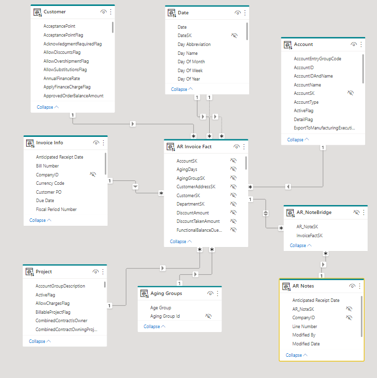

## Here is how the the AR area was dimesionally modeled in the data warehouse.

The most important consideration when modeling fact tables is to separate each process into its own table. Adamson, in his book "Star Schema The Complete Reference", gives two questions on which to base the decision on when to separate data into different tables:  

1. Do these facts occur simultaneously?
2. Are the facts available at the same level of detail (or grain)? 

The invoice and the invoice payment occur at different times -- the invoice is sent and then payment is hopefully received at a later date. The payment could also pay multiple invoices or be a partial payment on one invoice, so it is kept at a different grain than the invoice. Although the ERP was using one table for this data, it needed to be split into two tables for the dimensionally designed data warehouse. 

### 1. Invoice Fact

### 2. Invoice Payment Fact

