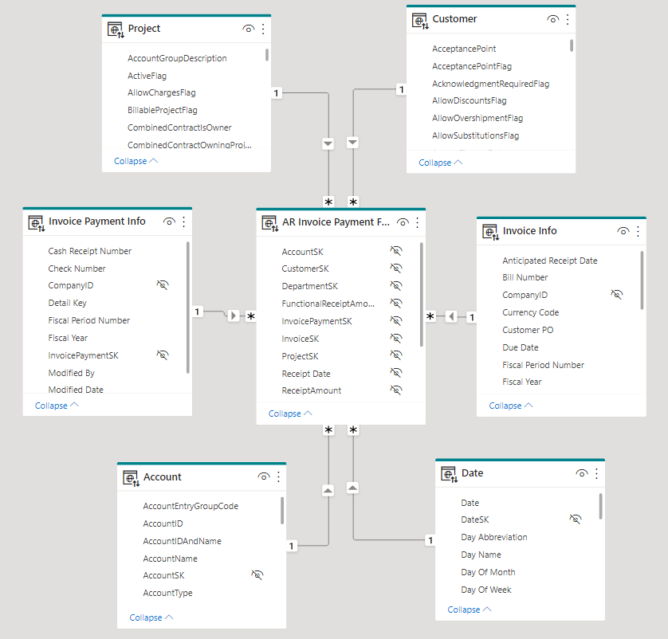

## Here is how the AR area was dimensionally modeled in the data warehouse.

The most important consideration when modeling fact tables is to separate each process into its own table. Adamson, in his book "Star Schema The Complete Reference", gives two questions on which to base the decision on when to separate data into different tables:  

1. Do these facts occur simultaneously?
2. Are the fact available at the same level of detail (or grain)? 

The invoice and the invoice payment occur at different times -- the invoice is sent and then payment is hopefully received at a later date. The payment could also pay multiple invoices or be a partial payment on one invoice, so it is kept at a different grain than the invoice. Although the ERP was using one table for this data, it needed to be split into two tables for the dimensionally designed data warehouse. 

### 1. Invoice Fact

The invoice fact has one interesting less common case where the relationship was many-to-many. In the ETL process from staging to the data warehouse, a bridge table is built that has a row for each combination of primary keys in the fact and the notes. In the data model above notice the bidirectional arrows from the bridge to the fact, this is necessary for Power BI to filter the data correctly. All other dimension tables only filter one way, from the dimension to the fact.    

### 2. Invoice Payment Fact

When multiple fact tables are deployed in the data warehouse, drill-across by using common dimensions -- which also works natively in Power BI. For example, the Invoice and Invoice Payment facts both share the Customer dimension so queries can use measures from both tables in the same Customer report. 
